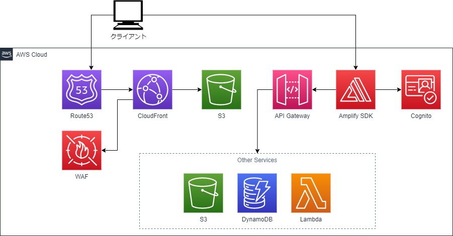

# Webプラットフォーム - 製品管理2

## この製作物でできること

1. ユーザー管理
2. データ入力
3. CSVファイル登録
4. 作業手順書の印刷
5. 統計情報の表示・グラフ化
6. 管理物の閲覧・ダウンロード

## 構成

- Node.js
  - React
  - MUI
- AWS
  - Route53
  - WAF
  - CloudFront
  - API Gateway
  - DynamoDB
  - S3
  - Cognito
  - Lambda

## 構成図

